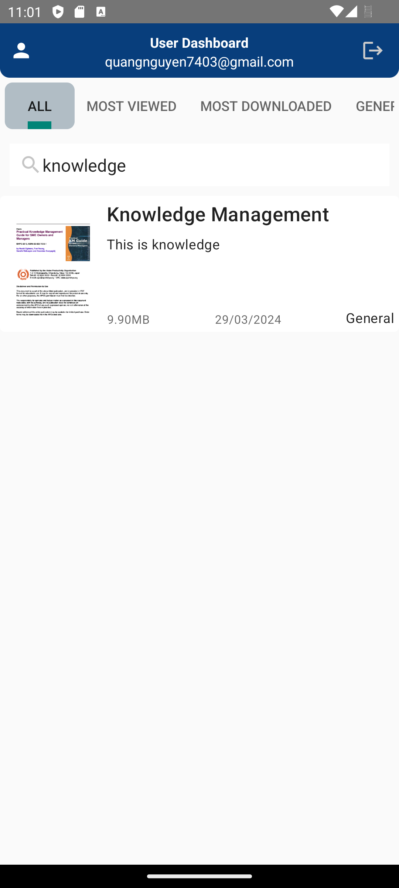
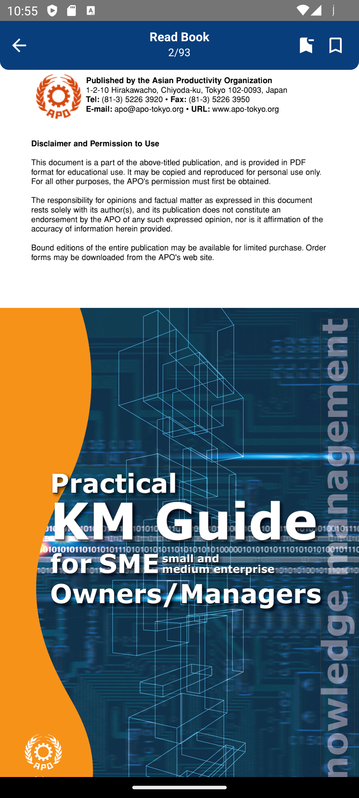
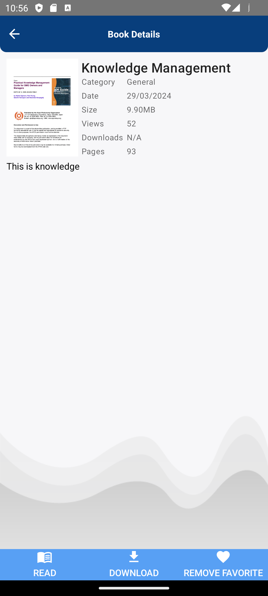
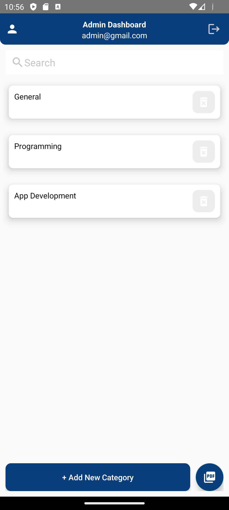

# Ebook Reader App
This repository contains the source code for a Book reader application using Android Studio, Java and Firebase.

# Introduction
EbookReader is a user-friendly Android application designed to help users read and manage their digital book collection effortlessly. This app provides customization options for an enhanced reading experience and includes features such as bookmarks and a library management system. You can also add new books to the platform as an admin.

## Features

- **Admin Management**: Add new categories, books details, upload your book to the platform.
- **Support PDF Formats**: Read ebooks in PDF formats.
- **Language**: Support English, Vietnamese and French.
- **Bookmarking**: Easily bookmark pages to continue reading later.
- **Library Management**: Organize your ebook collection with categories, tags, and search functionality, favorite books.
- **Profile Management**: Customize your profile with your own style.

## Preview

Here are some screenshots showcasing the UI of TechTopia:
1. **User UI**:
   

2. **Read Book Page**:
   

3. **Book Details**:
   

4. **Admin Dashboard**:
   

- See more in the screenshots folder
## Installation

1. **Clone the Repository**
    ```bash
    git clone https://github.com/DQuang7403/EbookReaderApp.git
    cd EbookReaderApp
    ```

2. **Open in Android Studio**
    - Open Android Studio.
    - Select `Open an existing Android Studio project`.
    - Navigate to the `EbookReaderApp` directory and select it.

3. **Install Dependencies**
    - Android Studio will prompt you to install any missing SDKs or dependencies. Follow the prompts to install them.

4. **Run the Application**
    - Connect an Android device via USB or start an emulator.
    - Click on the `Run` button in Android Studio or use the `Shift + F10` shortcut.

## Usage

1. **Add Books to Library**
    - Open the app and navigate to the dashboard.
    - Click on the "Add Favorite" button for later usage.

2. **Reading a Book**
    - Select a book from the library.
    - Download ebook file to your device.

3. **Bookmarking**
    - To bookmark a page for later, click the bookmark icon.
    - Click the bookmark icon to go to the bookmarked page, or delete the bookmark if needed.

4. **Admin**
    - Add new categories, book details.
    - Upload new book using pdf formats.
    - Email for admin: admin@gmail.com, pwd: 123456789. Feel free to try out the functionality.

## Contributing

We welcome contributions! Please follow these steps to contribute:

1. Fork the repository.
2. Create a new branch (`git checkout -b feature-branch`).
3. Make your changes and commit them (`git commit -m 'Add some feature'`).
4. Push to the branch (`git push origin feature-branch`).
5. Open a pull request.
